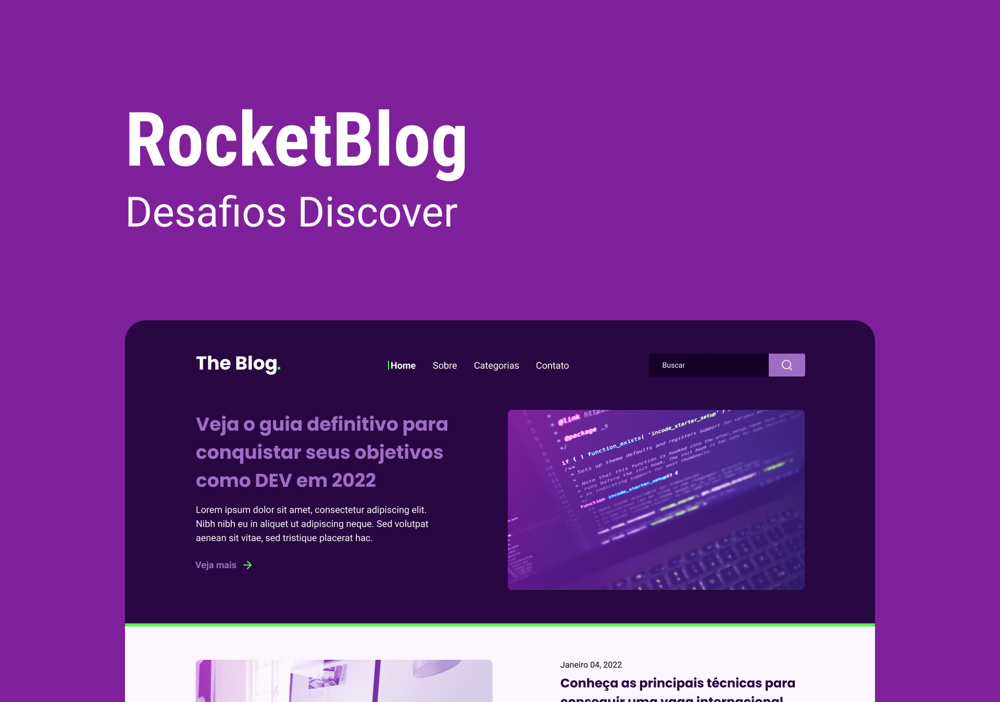
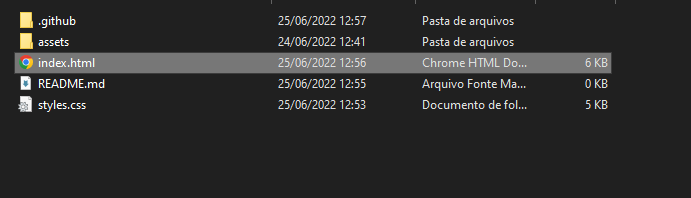

<h1 align="center">☕ RocketBlog ☕</h1>



## Requisitos

### Para clonar o projeto você vai precisar do <a href="https://git-scm.com/downloads">git</a>

## 🎲 Iniciando o projeto 

```bash
# Clonando o projeto
git clone https://github.com/rafaelmasselli/FrontEnd-RocketBlog
```

## Abrindo o projeto 

> Entre na pasta do projeto

> Aperte no index.html



> E assim ira abrir o projeto


## 🔖 Layout

Você pode visualizar o layout do projeto através do link abaixo:

- [Layout Web](https://www.figma.com/file/oHvC0fIVNyja7dV3denPZY/DD-RocketBlog-Copy?fuid=1086321388253863819)

Lembrando que você precisa ter uma conta no [Figma](http://figma.com/).

## Ferramentas usadas no projeto

- [x] HTML
- [x] CSS